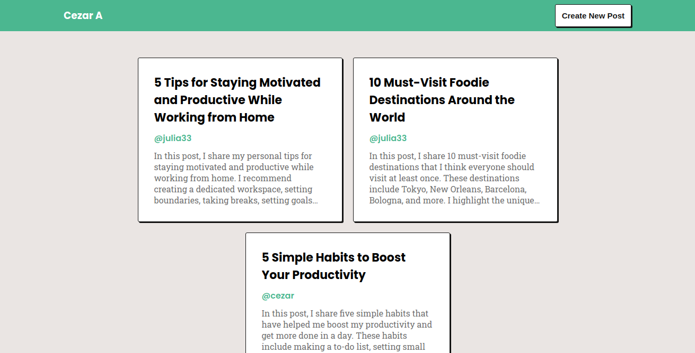
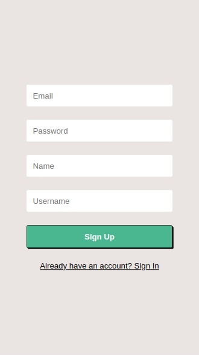
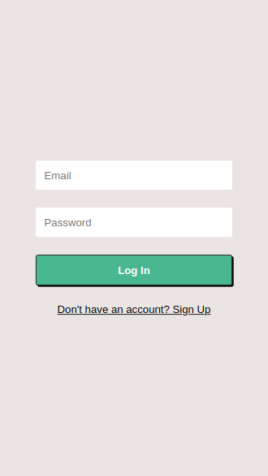
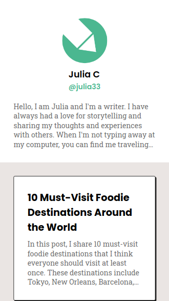
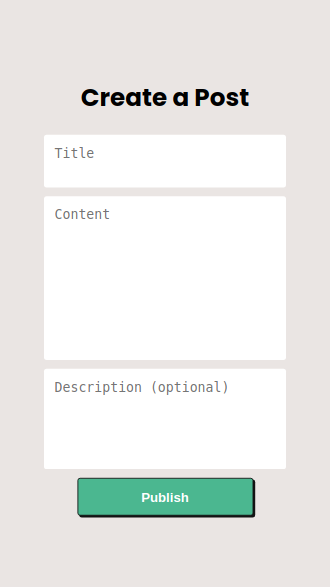
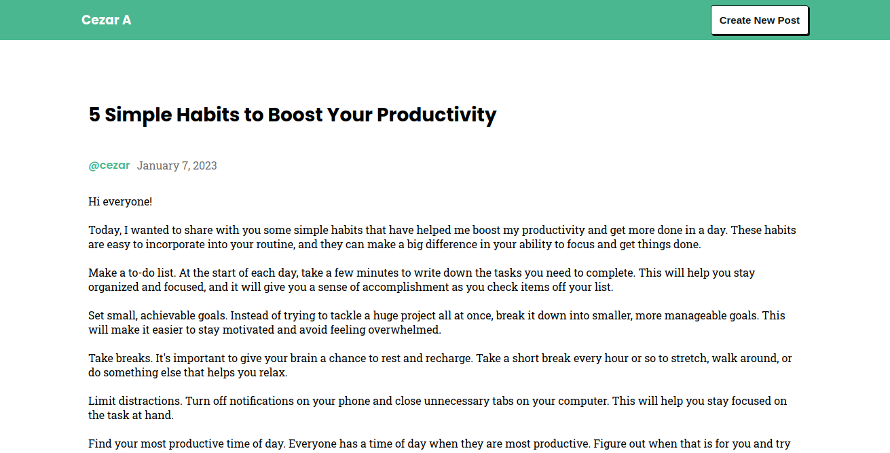
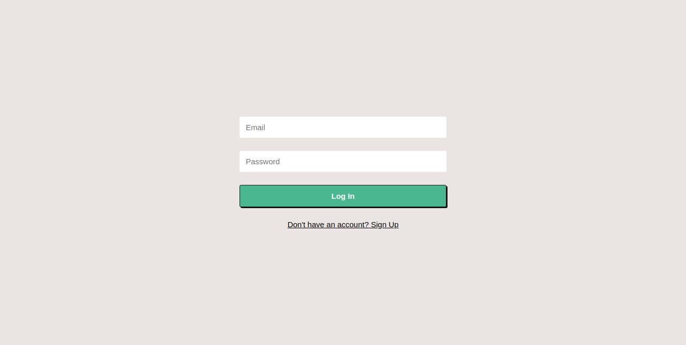
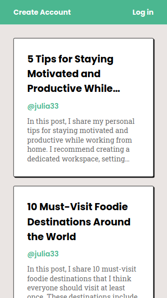
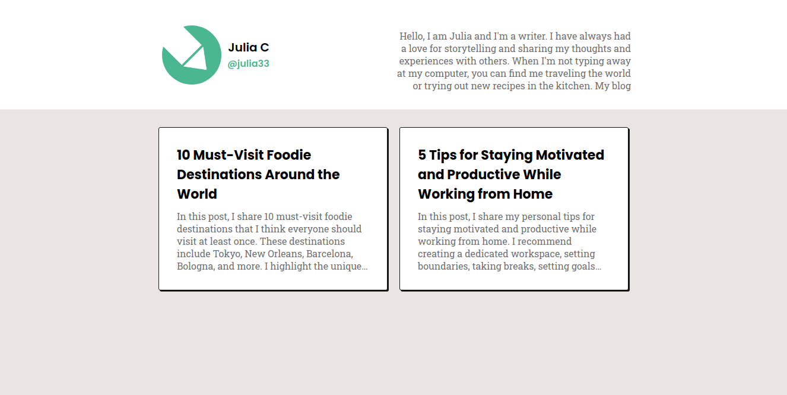

# Blog Frontend

The **Blog App** is a platform designed to connect writers. A place where you can share your ideas and engage with a community.
The app provides a collaborative environment where users can express themselves and participate in different discussions.

On the main page you find the latest posts made by the community.



Create a new account or log in to an existing account to have access to extra features.





You can also publish your own posts.




## Style

This project combines the styles of neo-brutalism and minimalism. It provides an interface that is easy to understand yet has a unique identity.



The color palette consists of four colors: white, green, black, and gray, with white and green as the main colors and black and gray as secondary colors."

-  `#EAE5E3`
-  `#4BB790`
-  `#131313`
-  `#6E6E6E`

## Responsive Design

All pages are designed to function effectively across various screen resolutions, from mobile devices to desktops.

### Login Page



### Posts Page



### Profile Page



## Technologies used

- JavaScript
- HTML
- CSS
- React

## Run locally

Clone the project.

```bash
git clone https://github.com/telesleo/blog-frontend.git
```

Enter the directory.

```bash
cd blog-frontend
```

Install the dependencies.

```bash
npm install
```

Run the app

```bash
npm start
```

To ensure the app functions properly, you need to have the server running locally. For instructions, you can access the repository [here](https://github.com/telesleo/blog-backend).

## Environment variables

`REACT_APP_API_URL` The URL of the API.

-----

Check out the backend of this project [here](https://github.com/telesleo/blog-backend).

:)

